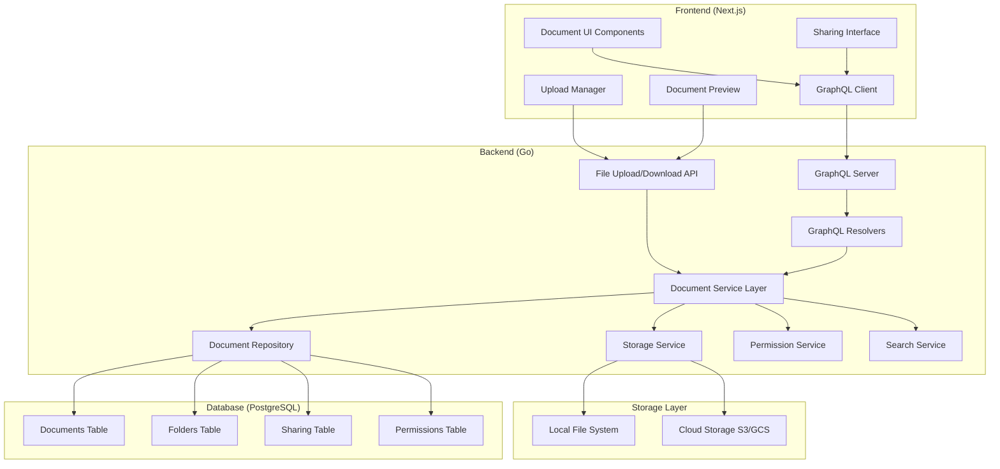

# Design Document

## Overview

The Document Storage System is a comprehensive cloud-based file management solution integrated into the Lumen platform. It provides secure document storage, sharing capabilities, and collaboration features similar to Google Drive. The system leverages the existing user authentication, role-based access control, and PostgreSQL database infrastructure while introducing new components for file storage, sharing permissions, and document management.

The design follows a microservices-oriented approach within the existing monolithic structure, with clear separation between file storage operations, permission management, and sharing mechanisms. The system supports multiple storage backends and implements robust security measures to protect user data and maintain privacy.

## Architecture

### Technology Stack and Libraries

**Backend Libraries (Go):**
- **File Processing**: 
  - `github.com/disintegration/imaging` (v1.6.2+) - Image processing and thumbnail generation
  - `github.com/gen2brain/go-fitz` (v1.23.0+) - PDF processing and preview generation
  - `github.com/xuri/excelize/v2` (v2.8.0+) - Excel file processing
  - `github.com/unidoc/unioffice` (v1.29.0+) - Office document processing
- **Media Processing**:
  - `github.com/3d0c/gmf` (v0.0.0+) - Video/audio processing via FFmpeg
  - `github.com/corona10/goimagehash` (v1.1.0+) - Image similarity and deduplication
- **Storage**:
  - `github.com/aws/aws-sdk-go-v2` (v1.24.0+) - AWS S3 integration
  - `cloud.google.com/go/storage` (v1.36.0+) - Google Cloud Storage
- **Security**:
  - `github.com/casbin/casbin/v2` (v2.81.0+) - Authorization and permission management
  - `github.com/golang-jwt/jwt/v5` (v5.2.0+) - JWT token handling
- **GraphQL**:
  - `github.com/99designs/gqlgen` (v0.17.40+) - GraphQL server generation
  - `github.com/vektah/dataloaden` (v0.3.0+) - DataLoader for efficient batching

**Frontend Libraries (TypeScript/React):**
- **GraphQL Client**:
  - `@apollo/client` (v3.8.0+) - GraphQL client with caching
  - `graphql-codegen` (v5.0.0+) - TypeScript type generation
- **File Upload**:
  - `react-dropzone` (v14.2.0+) - Drag-and-drop file upload
  - `@uppy/core` and `@uppy/react` (v3.18.0+) - Advanced file upload with progress
- **Document Preview**:
  - `react-pdf` (v7.6.0+) - PDF viewing and navigation
  - `@react-pdf-viewer/core` (v3.12.0+) - Advanced PDF viewer with plugins
  - `react-image-gallery` (v1.3.0+) - Image gallery with zoom/pan
  - `video.js` and `@videojs/react` (v8.6.0+) - Video player
  - `wavesurfer.js` (v7.6.0+) - Audio waveform visualization
  - `monaco-editor` and `@monaco-editor/react` (v4.6.0+) - Code syntax highlighting
- **UI Components**:
  - `@radix-ui/react-*` (v1.0.0+) - Accessible UI primitives
  - `framer-motion` (v10.16.0+) - Animations and transitions
  - `react-virtual` (v2.10.0+) - Virtualized lists for large datasets

### High-Level Architecture



### Database Schema Design

The system extends the existing database with new tables for document management:

```sql
-- Documents table
CREATE TABLE documents (
    id SERIAL PRIMARY KEY,
    name VARCHAR(255) NOT NULL,
    original_name VARCHAR(255) NOT NULL,
    file_path VARCHAR(500) NOT NULL,
    file_size BIGINT NOT NULL,
    mime_type VARCHAR(100) NOT NULL,
    checksum VARCHAR(64) NOT NULL,
    owner_id INTEGER NOT NULL REFERENCES users(id) ON DELETE CASCADE,
    folder_id INTEGER REFERENCES folders(id) ON DELETE SET NULL,
    is_deleted BOOLEAN DEFAULT FALSE,
    created_at TIMESTAMP WITH TIME ZONE DEFAULT NOW(),
    updated_at TIMESTAMP WITH TIME ZONE DEFAULT NOW()
);

-- Folders table
CREATE TABLE folders (
    id SERIAL PRIMARY KEY,
    name VARCHAR(255) NOT NULL,
    parent_id INTEGER REFERENCES folders(id) ON DELETE CASCADE,
    owner_id INTEGER NOT NULL REFERENCES users(id) ON DELETE CASCADE,
    is_deleted BOOLEAN DEFAULT FALSE,
    created_at TIMESTAMP WITH TIME ZONE DEFAULT NOW(),
    updated_at TIMESTAMP WITH TIME ZONE DEFAULT NOW()
);

-- Document sharing table
CREATE TABLE document_shares (
    id SERIAL PRIMARY KEY,
    document_id INTEGER REFERENCES documents(id) ON DELETE CASCADE,
    folder_id INTEGER REFERENCES folders(id) ON DELETE CASCADE,
    shared_by INTEGER NOT NULL REFERENCES users(id) ON DELETE CASCADE,
    shared_with_user INTEGER REFERENCES users(id) ON DELETE CASCADE,
    shared_with_role INTEGER REFERENCES roles(id) ON DELETE CASCADE,
    permission_level VARCHAR(20) NOT NULL CHECK (permission_level IN ('view', 'comment', 'edit')),
    is_public BOOLEAN DEFAULT FALSE,
    magic_link_token VARCHAR(64) UNIQUE,
    expires_at TIMESTAMP WITH TIME ZONE,
    created_at TIMESTAMP WITH TIME ZONE DEFAULT NOW()
);

-- Storage quotas table
CREATE TABLE storage_quotas (
    user_id INTEGER PRIMARY KEY REFERENCES users(id) ON DELETE CASCADE,
    quota_bytes BIGINT NOT NULL DEFAULT 1073741824, -- 1GB default
    used_bytes BIGINT NOT NULL DEFAULT 0,
    updated_at TIMESTAMP WITH TIME ZONE DEFAULT NOW()
);
```

### Storage Strategy

The system implements a pluggable storage architecture supporting multiple backends:

1. **Local File System**: For development and small deployments
2. **Cloud Storage**: AWS S3, Google Cloud Storage, or Azure Blob Storage for production
3. **Hybrid Approach**: Metadata in PostgreSQL, files in chosen storage backend

File organization follows a structured approach:
- Files stored with UUID-based names to prevent conflicts
- Directory structure: `/storage/{year}/{month}/{user_id}/{uuid}.{ext}`
- Metadata and original filenames stored in database
- Checksums for integrity verification

## Components and Interfaces

### GraphQL Schema Design

The system uses GraphQL for efficient data fetching with the following schema structure:

```graphql
type Document {
  id: ID!
  name: String!
  originalName: String!
  fileSize: Int!
  mimeType: String!
  ownerId: ID!
  folderId: ID
  isDeleted: Boolean!
  createdAt: Time!
  updatedAt: Time!
  
  # Resolved fields
  owner: User!
  folder: Folder
  previewUrl: String
  downloadUrl: String
  thumbnailUrl(size: ThumbnailSize): String
  permissions: Permission!
  shares: [DocumentShare!]!
  previewInfo: PreviewInfo!
}

type PreviewInfo {
  isSupported: Boolean!
  previewType: PreviewType!
  thumbnailSizes: [ThumbnailSize!]!
  previewUrl: String!
  embedUrl: String
  pageCount: Int
  duration: Float
  dimensions: Dimensions
}

type Dimensions {
  width: Int!
  height: Int!
}

enum PreviewType {
  IMAGE
  PDF
  TEXT
  CODE
  OFFICE
  VIDEO
  AUDIO
  HTML
}

enum ThumbnailSize {
  SMALL
  MEDIUM
  LARGE
}

type Folder {
  id: ID!
  name: String!
  parentId: ID
  ownerId: ID!
  isDeleted: Boolean!
  createdAt: Time!
  updatedAt: Time!
  
  # Resolved fields
  owner: User!
  parent: Folder
  children: [Folder!]!
  documents: [Document!]!
  permissions: Permission!
  shares: [DocumentShare!]!
}

type DocumentShare {
  id: ID!
  documentId: ID
  folderId: ID
  sharedBy: ID!
  sharedWithUser: ID
  sharedWithRole: ID
  permissionLevel: PermissionLevel!
  isPublic: Boolean!
  magicLinkToken: String
  expiresAt: Time
  createdAt: Time!
}

type Permission {
  canView: Boolean!
  canComment: Boolean!
  canEdit: Boolean!
  canShare: Boolean!
  canDelete: Boolean!
  canAdmin: Boolean!
  isOwner: Boolean!
  inheritedFrom: String
  expiresAt: Time
  conditions: JSON
}

type PermissionPolicy {
  subject: String!
  object: String!
  action: String!
  effect: String!
  conditions: JSON
  grantedBy: ID!
  createdAt: Time!
  expiresAt: Time
}

input GrantPermissionInput {
  subject: String!
  object: String!
  action: String!
  effect: String!
  conditions: JSON
  expiresAt: Time
}

input RevokePermissionInput {
  subject: String!
  object: String!
  action: String!
}

type StorageUsage {
  userId: ID!
  quotaBytes: Int!
  usedBytes: Int!
  availableBytes: Int!
  usagePercent: Float!
}

enum PermissionLevel {
  VIEW
  COMMENT
  EDIT
}

type Query {
  # Document queries
  document(id: ID!): Document
  documents(folderId: ID, limit: Int, offset: Int): [Document!]!
  searchDocuments(query: String!, filters: SearchFilters): [Document!]!
  
  # Folder queries
  folder(id: ID!): Folder
  folders(parentId: ID): [Folder!]!
  folderContents(id: ID!): FolderContents!
  
  # Sharing queries
  sharedWithMe(resourceType: ResourceType): [SharedResource!]!
  documentShares(documentId: ID!): [DocumentShare!]!
  folderShares(folderId: ID!): [DocumentShare!]!
  
  # Storage queries
  storageUsage: StorageUsage!
  
  # Magic link queries
  magicLinkResource(token: String!): MagicLinkResource
}

type Mutation {
  # Document mutations
  createDocument(input: CreateDocumentInput!): Document!
  updateDocument(id: ID!, input: UpdateDocumentInput!): Document!
  deleteDocument(id: ID!): Boolean!
  moveDocument(id: ID!, folderId: ID): Document!
  
  # Folder mutations
  createFolder(input: CreateFolderInput!): Folder!
  updateFolder(id: ID!, input: UpdateFolderInput!): Folder!
  deleteFolder(id: ID!): Boolean!
  moveFolder(id: ID!, parentId: ID): Folder!
  
  # Advanced permission mutations
  grantPermission(input: GrantPermissionInput!): PermissionPolicy!
  revokePermission(input: RevokePermissionInput!): Boolean!
  grantBulkPermissions(inputs: [GrantPermissionInput!]!): [PermissionPolicy!]!
  
  # Legacy sharing mutations (for backward compatibility)
  shareWithUser(input: ShareWithUserInput!): DocumentShare!
  shareWithRole(input: ShareWithRoleInput!): DocumentShare!
  createMagicLink(input: CreateMagicLinkInput!): MagicLink!
  updatePermission(shareId: ID!, permission: PermissionLevel!): DocumentShare!
  revokeAccess(shareId: ID!): Boolean!
  revokeMagicLink(token: String!): Boolean!
  
  # Storage mutations
  updateStorageQuota(userId: ID!, quotaBytes: Int!): StorageUsage!
}
```

### Document Service Layer

```go
type DocumentService interface {
    // Document operations
    UploadDocument(userID int64, file *multipart.FileHeader, folderID *int64) (*Document, error)
    GetDocument(userID int64, documentID int64) (*Document, error)
    GetUserDocuments(userID int64, folderID *int64, limit, offset int) ([]*Document, error)
    UpdateDocument(userID int64, documentID int64, updates *DocumentUpdate) error
    DeleteDocument(userID int64, documentID int64) error
    MoveDocument(userID int64, documentID int64, folderID *int64) error
    
    // Folder operations
    CreateFolder(userID int64, name string, parentID *int64) (*Folder, error)
    GetFolder(userID int64, folderID int64) (*Folder, error)
    GetFolderContents(userID int64, folderID int64) (*FolderContents, error)
    UpdateFolder(userID int64, folderID int64, updates *FolderUpdate) error
    DeleteFolder(userID int64, folderID int64) error
    MoveFolder(userID int64, folderID int64, parentID *int64) error
    
    // Search operations
    SearchDocuments(userID int64, query string, filters *SearchFilters) ([]*Document, error)
    
    // Storage operations
    GetStorageUsage(userID int64) (*StorageUsage, error)
    UpdateStorageQuota(userID int64, newQuota int64) error
}
```

### GraphQL Resolvers

```go
type DocumentResolver struct {
    service DocumentService
    sharingService SharingService
}

func (r *DocumentResolver) Owner(ctx context.Context, obj *Document) (*User, error) {
    return r.service.GetUser(obj.OwnerID)
}

func (r *DocumentResolver) Folder(ctx context.Context, obj *Document) (*Folder, error) {
    if obj.FolderID == nil {
        return nil, nil
    }
    return r.service.GetFolder(getUserID(ctx), *obj.FolderID)
}

func (r *DocumentResolver) Permissions(ctx context.Context, obj *Document) (*Permission, error) {
    userID := getUserID(ctx)
    return r.sharingService.GetResourcePermissions(userID, obj.ID, "document")
}

func (r *DocumentResolver) Shares(ctx context.Context, obj *Document) ([]*DocumentShare, error) {
    userID := getUserID(ctx)
    return r.sharingService.GetDocumentShares(userID, obj.ID)
}

type QueryResolver struct {
    documentService DocumentService
    sharingService SharingService
}

func (r *QueryResolver) Document(ctx context.Context, id string) (*Document, error) {
    userID := getUserID(ctx)
    docID, err := strconv.ParseInt(id, 10, 64)
    if err != nil {
        return nil, err
    }
    return r.documentService.GetDocument(userID, docID)
}

func (r *QueryResolver) Documents(ctx context.Context, folderID *string, limit *int, offset *int) ([]*Document, error) {
    userID := getUserID(ctx)
    var fID *int64
    if folderID != nil {
        id, err := strconv.ParseInt(*folderID, 10, 64)
        if err != nil {
            return nil, err
        }
        fID = &id
    }
    
    l := 50 // default limit
    if limit != nil {
        l = *limit
    }
    
    o := 0 // default offset
    if offset != nil {
        o = *offset
    }
    
    return r.documentService.GetUserDocuments(userID, fID, l, o)
}
```

### Sharing Service Layer

```go
type SharingService interface {
    // User sharing
    ShareWithUser(ownerID int64, resourceID int64, resourceType string, targetUserID int64, permission string) (*DocumentShare, error)
    ShareWithUsers(ownerID int64, resourceID int64, resourceType string, targetUserIDs []int64, permission string) ([]*DocumentShare, error)
    
    // Role/Group sharing
    ShareWithRole(ownerID int64, resourceID int64, resourceType string, roleID int64, permission string) (*DocumentShare, error)
    
    // Magic link sharing
    CreateMagicLink(ownerID int64, resourceID int64, resourceType string, permission string, expiresAt *time.Time) (*MagicLink, error)
    GetMagicLink(token string) (*MagicLink, error)
    RevokeMagicLink(ownerID int64, token string) error
    
    // Permission management
    GetResourcePermissions(userID int64, resourceID int64, resourceType string) (*Permission, error)
    GetDocumentShares(userID int64, documentID int64) ([]*DocumentShare, error)
    GetFolderShares(userID int64, folderID int64) ([]*DocumentShare, error)
    UpdatePermission(ownerID int64, shareID int64, newPermission string) (*DocumentShare, error)
    RevokeAccess(ownerID int64, shareID int64) error
    
    // Access validation
    CanAccess(userID int64, resourceID int64, resourceType string, requiredPermission string) (bool, error)
    GetSharedResources(userID int64, resourceType string) ([]*SharedResource, error)
}
```

### Storage Service Layer

```go
type StorageService interface {
    // File operations
    StoreFile(file io.Reader, filename string, contentType string) (*StorageResult, error)
    GetFile(filePath string) (io.ReadCloser, error)
    DeleteFile(filePath string) error
    GetFileInfo(filePath string) (*FileInfo, error)
    
    // Utility operations
    GeneratePreviewURL(filePath string, expiresIn time.Duration) (string, error)
    CalculateChecksum(file io.Reader) (string, error)
    ValidateFileType(contentType string) error
    ValidateFileSize(size int64) error
}

type PreviewService interface {
    // Preview generation
    GeneratePreview(filePath string, mimeType string) (*PreviewResult, error)
    GetPreviewURL(documentID int64, previewType PreviewType) (string, error)
    
    // Thumbnail generation
    GenerateThumbnail(filePath string, mimeType string, size ThumbnailSize) (*ThumbnailResult, error)
    GetThumbnailURL(documentID int64, size ThumbnailSize) (string, error)
    
    // Preview support checking
    IsPreviewSupported(mimeType string) bool
    GetSupportedPreviewTypes(mimeType string) []PreviewType
    
    // Text extraction for search
    ExtractText(filePath string, mimeType string) (string, error)
}

type PreviewType string

const (
    PreviewTypeImage     PreviewType = "image"
    PreviewTypePDF       PreviewType = "pdf"
    PreviewTypeText      PreviewType = "text"
    PreviewTypeCode      PreviewType = "code"
    PreviewTypeOffice    PreviewType = "office"
    PreviewTypeVideo     PreviewType = "video"
    PreviewTypeAudio     PreviewType = "audio"
    PreviewTypeHTML      PreviewType = "html"
)

type ThumbnailSize string

const (
    ThumbnailSmall  ThumbnailSize = "small"   // 150x150
    ThumbnailMedium ThumbnailSize = "medium"  // 300x300
    ThumbnailLarge  ThumbnailSize = "large"   // 600x600
)
```

## Data Models

### Core Document Models

```go
type Document struct {
    ID           int64     `json:"id"`
    Name         string    `json:"name"`
    OriginalName string    `json:"original_name"`
    FilePath     string    `json:"-"` // Hidden from JSON for security
    FileSize     int64     `json:"file_size"`
    MimeType     string    `json:"mime_type"`
    Checksum     string    `json:"checksum"`
    OwnerID      int64     `json:"owner_id"`
    FolderID     *int64    `json:"folder_id"`
    IsDeleted    bool      `json:"is_deleted"`
    CreatedAt    time.Time `json:"created_at"`
    UpdatedAt    time.Time `json:"updated_at"`
    
    // Computed fields
    Owner           *User       `json:"owner,omitempty"`
    Folder          *Folder     `json:"folder,omitempty"`
    PreviewURL      string      `json:"preview_url,omitempty"`
    DownloadURL     string      `json:"download_url,omitempty"`
    ThumbnailURL    string      `json:"thumbnail_url,omitempty"`
    Permissions     *Permission `json:"permissions,omitempty"`
    PreviewInfo     *PreviewInfo `json:"preview_info,omitempty"`
}

type PreviewInfo struct {
    IsSupported     bool          `json:"is_supported"`
    PreviewType     PreviewType   `json:"preview_type"`
    ThumbnailSizes  []ThumbnailSize `json:"thumbnail_sizes"`
    PreviewURL      string        `json:"preview_url"`
    EmbedURL        string        `json:"embed_url,omitempty"`
    PageCount       *int          `json:"page_count,omitempty"`
    Duration        *float64      `json:"duration,omitempty"` // For video/audio
    Dimensions      *Dimensions   `json:"dimensions,omitempty"` // For images/videos
}

type Dimensions struct {
    Width  int `json:"width"`
    Height int `json:"height"`
}

type PreviewResult struct {
    PreviewType PreviewType `json:"preview_type"`
    PreviewURL  string      `json:"preview_url"`
    EmbedURL    string      `json:"embed_url,omitempty"`
    Metadata    map[string]interface{} `json:"metadata,omitempty"`
}

type ThumbnailResult struct {
    ThumbnailURL string        `json:"thumbnail_url"`
    Size         ThumbnailSize `json:"size"`
    Dimensions   Dimensions    `json:"dimensions"`
}

type Folder struct {
    ID        int64     `json:"id"`
    Name      string    `json:"name"`
    ParentID  *int64    `json:"parent_id"`
    OwnerID   int64     `json:"owner_id"`
    IsDeleted bool      `json:"is_deleted"`
    CreatedAt time.Time `json:"created_at"`
    UpdatedAt time.Time `json:"updated_at"`
    
    // Computed fields
    Owner       *User     `json:"owner,omitempty"`
    Parent      *Folder   `json:"parent,omitempty"`
    Children    []*Folder `json:"children,omitempty"`
    Documents   []*Document `json:"documents,omitempty"`
    Permissions *Permission `json:"permissions,omitempty"`
}

type DocumentShare struct {
    ID               int64     `json:"id"`
    DocumentID       *int64    `json:"document_id"`
    FolderID         *int64    `json:"folder_id"`
    SharedBy         int64     `json:"shared_by"`
    SharedWithUser   *int64    `json:"shared_with_user"`
    SharedWithRole   *int64    `json:"shared_with_role"`
    PermissionLevel  string    `json:"permission_level"`
    IsPublic         bool      `json:"is_public"`
    MagicLinkToken   *string   `json:"magic_link_token,omitempty"`
    ExpiresAt        *time.Time `json:"expires_at"`
    CreatedAt        time.Time `json:"created_at"`
}
```

### Advanced Permission System with Casbin

The system implements a comprehensive Role-Based Access Control (RBAC) with Attribute-Based Access Control (ABAC) using Casbin for fine-grained permissions.

```go
// Permission model using Casbin policy format
// Policy: subject, object, action, effect
// Example: "user:123", "document:456", "read", "allow"
//          "role:teacher", "folder:789", "write", "allow"

type PermissionService interface {
    // Core permission checking
    CheckPermission(subject, object, action string) (bool, error)
    
    // Document permissions
    CanViewDocument(userID int64, documentID int64) (bool, error)
    CanEditDocument(userID int64, documentID int64) (bool, error)
    CanDeleteDocument(userID int64, documentID int64) (bool, error)
    CanShareDocument(userID int64, documentID int64) (bool, error)
    
    // Folder permissions (inherited by contents)
    CanViewFolder(userID int64, folderID int64) (bool, error)
    CanEditFolder(userID int64, folderID int64) (bool, error)
    CanCreateInFolder(userID int64, folderID int64) (bool, error)
    
    // Permission management
    GrantPermission(granterID int64, subject, object, action string) error
    RevokePermission(granterID int64, subject, object, action string) error
    
    // Bulk operations
    GetUserPermissions(userID int64, resourceType string) ([]*Permission, error)
    GetResourcePermissions(resourceID int64, resourceType string) ([]*Permission, error)
}

type Permission struct {
    Subject     string    `json:"subject"`      // user:123, role:teacher, group:class1
    Object      string    `json:"object"`       // document:456, folder:789
    Action      string    `json:"action"`       // read, write, delete, share, admin
    Effect      string    `json:"effect"`       // allow, deny
    Conditions  map[string]interface{} `json:"conditions,omitempty"` // time-based, IP-based, etc.
    GrantedBy   int64     `json:"granted_by"`
    CreatedAt   time.Time `json:"created_at"`
    ExpiresAt   *time.Time `json:"expires_at,omitempty"`
}

// Casbin model configuration
const CasbinModel = `
[request_definition]
r = sub, obj, act

[policy_definition]
p = sub, obj, act, eft

[role_definition]
g = _, _
g2 = _, _

[policy_effect]
e = some(where (p.eft == allow)) && !some(where (p.eft == deny))

[matchers]
m = g(r.sub, p.sub) && keyMatch2(r.obj, p.obj) && regexMatch(r.act, p.act)
`

type AdvancedPermission struct {
    CanView         bool      `json:"can_view"`
    CanComment      bool      `json:"can_comment"`
    CanEdit         bool      `json:"can_edit"`
    CanShare        bool      `json:"can_share"`
    CanDelete       bool      `json:"can_delete"`
    CanAdmin        bool      `json:"can_admin"`
    IsOwner         bool      `json:"is_owner"`
    InheritedFrom   *string   `json:"inherited_from,omitempty"` // folder:123, role:teacher
    ExpiresAt       *time.Time `json:"expires_at,omitempty"`
    Conditions      map[string]interface{} `json:"conditions,omitempty"`
}

type MagicLink struct {
    Token           string    `json:"token"`
    ResourceID      int64     `json:"resource_id"`
    ResourceType    string    `json:"resource_type"`
    PermissionLevel string    `json:"permission_level"`
    CreatedBy       int64     `json:"created_by"`
    ExpiresAt       *time.Time `json:"expires_at"`
    CreatedAt       time.Time `json:"created_at"`
    AccessCount     int       `json:"access_count"`
    MaxAccess       *int      `json:"max_access,omitempty"`
    IPRestrictions  []string  `json:"ip_restrictions,omitempty"`
    PasswordHash    *string   `json:"password_hash,omitempty"`
}

type StorageUsage struct {
    UserID         int64   `json:"user_id"`
    QuotaBytes     int64   `json:"quota_bytes"`
    UsedBytes      int64   `json:"used_bytes"`
    AvailableBytes int64   `json:"available_bytes"`
    UsagePercent   float64 `json:"usage_percent"`
    FileCount      int64   `json:"file_count"`
    FolderCount    int64   `json:"folder_count"`
    SharedCount    int64   `json:"shared_count"`
}

// Permission actions
const (
    ActionRead   = "read"
    ActionWrite  = "write" 
    ActionDelete = "delete"
    ActionShare  = "share"
    ActionAdmin  = "admin"
)

// Resource types
const (
    ResourceDocument = "document"
    ResourceFolder   = "folder"
    ResourceUser     = "user"
)

// Subject types
const (
    SubjectUser  = "user"
    SubjectRole  = "role"
    SubjectGroup = "group"
)
```

## Error Handling

### Error Types and Responses

The system implements comprehensive error handling with specific error types:

```go
type DocumentError struct {
    Code    string `json:"code"`
    Message string `json:"message"`
    Details map[string]interface{} `json:"details,omitempty"`
}

// Error codes
const (
    ErrDocumentNotFound     = "DOCUMENT_NOT_FOUND"
    ErrFolderNotFound      = "FOLDER_NOT_FOUND"
    ErrPermissionDenied    = "PERMISSION_DENIED"
    ErrStorageQuotaExceeded = "STORAGE_QUOTA_EXCEEDED"
    ErrInvalidFileType     = "INVALID_FILE_TYPE"
    ErrFileSizeExceeded    = "FILE_SIZE_EXCEEDED"
    ErrMagicLinkExpired    = "MAGIC_LINK_EXPIRED"
    ErrMagicLinkNotFound   = "MAGIC_LINK_NOT_FOUND"
    ErrDuplicateFileName   = "DUPLICATE_FILE_NAME"
    ErrStorageFailure      = "STORAGE_FAILURE"
)
```

### Error Handling Strategy

1. **Validation Errors**: Return 400 Bad Request with detailed field-level errors
2. **Authentication Errors**: Return 401 Unauthorized with clear messaging
3. **Permission Errors**: Return 403 Forbidden with resource-specific context
4. **Not Found Errors**: Return 404 Not Found with resource type information
5. **Storage Errors**: Return 507 Insufficient Storage for quota issues
6. **Server Errors**: Return 500 Internal Server Error with sanitized messages

## Testing Strategy

### Unit Testing

1. **Service Layer Tests**:
   - Document CRUD operations
   - Permission validation logic
   - Storage quota calculations
   - File type and size validation

2. **Repository Layer Tests**:
   - Database operations with test fixtures
   - Query optimization verification
   - Transaction handling

3. **Storage Layer Tests**:
   - File upload/download operations
   - Checksum validation
   - Storage backend abstraction

### Integration Testing

1. **API Endpoint Tests**:
   - Full request/response cycle testing
   - Authentication and authorization flows
   - File upload with various formats and sizes

2. **Database Integration Tests**:
   - Migration testing
   - Constraint validation
   - Performance testing with large datasets

3. **Storage Integration Tests**:
   - Multiple storage backend compatibility
   - File integrity verification
   - Concurrent access handling

### End-to-End Testing

1. **User Workflow Tests**:
   - Complete document upload and sharing workflows
   - Permission inheritance testing
   - Magic link functionality

2. **Performance Tests**:
   - Large file upload handling
   - Concurrent user operations
   - Storage quota enforcement

3. **Security Tests**:
   - Access control validation
   - File type security scanning
   - Magic link security verification

### Test Data Management

- Use database transactions for test isolation
- Implement test file cleanup mechanisms
- Create realistic test datasets for performance testing
- Mock external storage services for unit tests