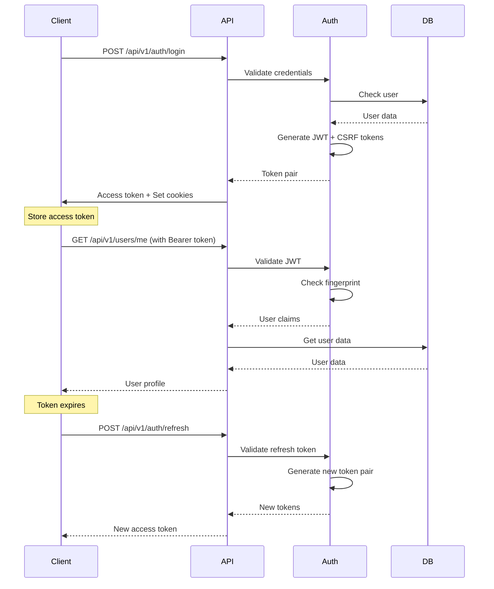

# API Integration Guide - Lumen Security Layer

## Table of Contents
1. [Quick Start](#quick-start)
2. [Frontend Integration](#frontend-integration)
3. [API Client Examples](#api-client-examples)
4. [Authentication Flow](#authentication-flow)
5. [Error Handling](#error-handling)
6. [Testing](#testing)
7. [Production Deployment](#production-deployment)

## Quick Start

### 1. Import Required Packages

```go
import (
    "github.com/gin-gonic/gin"
    "github.com/Srivathsav-max/lumen/backend/internal/security"
    "github.com/Srivathsav-max/lumen/backend/internal/middleware"
    "github.com/Srivathsav-max/lumen/backend/internal/services"
)
```

### 2. Basic API Setup

```go
func main() {
    // Initialize services
    authService := services.NewAuthService(db, logger)
    userService := services.NewUserService(db, logger)
    
    // Create router with security
    router := setupSecureRouter(authService, userService, logger)
    
    // Start server
    router.Run(":8080")
}

func setupSecureRouter(
    authService services.AuthService,
    userService services.UserService,
    logger *slog.Logger,
) *gin.Engine {
    router := gin.New()
    
    // Security configuration
    securityConfig := security.DefaultSecurityConfig()
    securityMiddleware := security.NewSecurityMiddleware(securityConfig, logger)
    
    // Apply security middleware
    router.Use(middleware.RequestIDMiddleware())
    router.Use(middleware.CORSMiddleware())
    router.Use(securityMiddleware.SecurityHeadersMiddleware())
    router.Use(middleware.RateLimitMiddleware(
        middleware.DefaultRateLimitConfig(), logger))
    router.Use(securityMiddleware.XSSProtectionMiddleware())
    router.Use(middleware.ErrorHandlingMiddleware(logger))
    
    // Setup routes
    setupAuthRoutes(router, authService, securityMiddleware)
    setupProtectedRoutes(router, authService, userService, securityMiddleware)
    
    return router
}
```

### 3. Authentication Routes

```go
func setupAuthRoutes(
    router *gin.Engine,
    authService services.AuthService,
    securityMiddleware *security.SecurityMiddleware,
) {
    auth := router.Group("/api/v1/auth")
    
    // Public authentication endpoints
    auth.POST("/register", registerHandler(authService))
    auth.POST("/login", loginHandler(authService))
    auth.POST("/forgot-password", forgotPasswordHandler(authService))
    auth.POST("/reset-password", resetPasswordHandler(authService))
    
    // Protected authentication endpoints
    protected := auth.Group("")
    protected.Use(middleware.AuthMiddleware(authService, logger))
    protected.Use(securityMiddleware.CSRFMiddleware())
    
    protected.POST("/refresh", refreshTokenHandler(authService))
    protected.POST("/logout", logoutHandler(authService))
    protected.POST("/change-password", changePasswordHandler(authService))
}
```

### 4. Protected API Routes

```go
func setupProtectedRoutes(
    router *gin.Engine,
    authService services.AuthService,
    userService services.UserService,
    securityMiddleware *security.SecurityMiddleware,
) {
    api := router.Group("/api/v1")
    api.Use(middleware.AuthMiddleware(authService, logger))
    api.Use(securityMiddleware.CSRFMiddleware())
    
    // User endpoints
    users := api.Group("/users")
    users.GET("/me", getCurrentUserHandler(userService))
    users.PUT("/me", updateUserHandler(userService))
    users.DELETE("/me", deleteUserHandler(userService))
    
    // Admin endpoints
    admin := api.Group("/admin")
    admin.Use(middleware.RoleMiddleware([]string{"admin"}, logger))
    admin.GET("/users", listUsersHandler(userService))
    admin.POST("/users/:id/ban", banUserHandler(userService))
}
```

## Frontend Integration

### React/TypeScript Integration

#### 1. Security Client Class

```typescript
// src/lib/security-client.ts
export class SecurityClient {
    private baseURL: string;
    private accessToken: string = '';
    private csrfToken: string = '';
    private refreshPromise: Promise<void> | null = null;
    
    constructor(baseURL: string) {
        this.baseURL = baseURL;
        this.initializeCSRF();
    }
    
    // Initialize CSRF token
    private async initializeCSRF(): Promise<void> {
        try {
            const response = await fetch(`${this.baseURL}/api/v1/security/csrf-token`, {
                method: 'GET',
                credentials: 'include',
                headers: {
                    'Content-Type': 'application/json',
                }
            });
            
            if (response.ok) {
                const data = await response.json();
                this.csrfToken = data.csrf_token;
            }
        } catch (error) {
            console.error('Failed to initialize CSRF token:', error);
        }
    }
    
    // Set access token
    setAccessToken(token: string): void {
        this.accessToken = token;
    }
    
    // Make authenticated API request
    async request<T>(
        endpoint: string, 
        options: RequestInit = {}
    ): Promise<T> {
        const headers: Record<string, string> = {
            'Content-Type': 'application/json',
            ...options.headers as Record<string, string>,
        };
        
        // Add CSRF token for state-changing operations
        if (['POST', 'PUT', 'DELETE', 'PATCH'].includes(options.method?.toUpperCase() || 'GET')) {
            headers['X-CSRF-Token'] = this.csrfToken;
        }
        
        // Add authorization header
        if (this.accessToken) {
            headers['Authorization'] = `Bearer ${this.accessToken}`;
        }
        
        const response = await fetch(`${this.baseURL}${endpoint}`, {
            ...options,
            credentials: 'include',
            headers,
        });
        
        // Handle token refresh
        if (response.status === 401 && this.accessToken) {
            await this.handleTokenRefresh();
            
            // Retry request with new token
            headers['Authorization'] = `Bearer ${this.accessToken}`;
            const retryResponse = await fetch(`${this.baseURL}${endpoint}`, {
                ...options,
                credentials: 'include',
                headers,
            });
            
            return this.handleResponse<T>(retryResponse);
        }
        
        return this.handleResponse<T>(response);
    }
    
    // Handle token refresh
    private async handleTokenRefresh(): Promise<void> {
        if (this.refreshPromise) {
            return this.refreshPromise;
        }
        
        this.refreshPromise = this.performTokenRefresh();
        
        try {
            await this.refreshPromise;
        } finally {
            this.refreshPromise = null;
        }
    }
    
    private async performTokenRefresh(): Promise<void> {
        try {
            const response = await fetch(`${this.baseURL}/api/v1/auth/refresh`, {
                method: 'POST',
                credentials: 'include',
                headers: {
                    'Content-Type': 'application/json',
                    'X-CSRF-Token': this.csrfToken,
                },
            });
            
            if (response.ok) {
                const data = await response.json();
                this.accessToken = data.access_token;
            } else {
                // Redirect to login
                window.location.href = '/login';
            }
        } catch (error) {
            console.error('Token refresh failed:', error);
            window.location.href = '/login';
        }
    }
    
    // Handle response
    private async handleResponse<T>(response: Response): Promise<T> {
        if (!response.ok) {
            const error = await response.json().catch(() => ({ 
                error: 'Network error' 
            }));
            throw new APIError(response.status, error.error || 'Unknown error');
        }
        
        const contentType = response.headers.get('content-type');
        if (contentType && contentType.includes('application/json')) {
            return response.json();
        }
        
        return response.text() as unknown as T;
    }
    
    // Authentication methods
    async login(email: string, password: string): Promise<LoginResponse> {
        const response = await this.request<LoginResponse>('/api/v1/auth/login', {
            method: 'POST',
            body: JSON.stringify({ email, password }),
        });
        
        this.setAccessToken(response.access_token);
        return response;
    }
    
    async register(userData: RegisterRequest): Promise<RegisterResponse> {
        return this.request<RegisterResponse>('/api/v1/auth/register', {
            method: 'POST',
            body: JSON.stringify(userData),
        });
    }
    
    async logout(): Promise<void> {
        await this.request('/api/v1/auth/logout', {
            method: 'POST',
        });
        
        this.accessToken = '';
    }
    
    // User methods
    async getCurrentUser(): Promise<User> {
        return this.request<User>('/api/v1/users/me');
    }
    
    async updateUser(userData: UpdateUserRequest): Promise<User> {
        return this.request<User>('/api/v1/users/me', {
            method: 'PUT',
            body: JSON.stringify(userData),
        });
    }
}

// Error handling
export class APIError extends Error {
    constructor(public status: number, message: string) {
        super(message);
        this.name = 'APIError';
    }
}

// Types
export interface LoginResponse {
    access_token: string;
    refresh_token: string;
    user: User;
}

export interface RegisterRequest {
    email: string;
    password: string;
    first_name: string;
    last_name: string;
}

export interface RegisterResponse {
    user: User;
    message: string;
}

export interface User {
    id: number;
    email: string;
    first_name: string;
    last_name: string;
    roles: string[];
    created_at: string;
    updated_at: string;
}

export interface UpdateUserRequest {
    first_name?: string;
    last_name?: string;
    email?: string;
}
```

#### 2. React Hook for Authentication

```typescript
// src/hooks/useAuth.ts
import { useState, useEffect, useContext, createContext } from 'react';
import { SecurityClient, User, LoginResponse } from '../lib/security-client';

interface AuthContextType {
    user: User | null;
    loading: boolean;
    login: (email: string, password: string) => Promise<void>;
    logout: () => Promise<void>;
    register: (userData: RegisterRequest) => Promise<void>;
    updateUser: (userData: UpdateUserRequest) => Promise<void>;
}

const AuthContext = createContext<AuthContextType | undefined>(undefined);

export function AuthProvider({ children }: { children: React.ReactNode }) {
    const [user, setUser] = useState<User | null>(null);
    const [loading, setLoading] = useState(true);
    const [client] = useState(() => new SecurityClient(process.env.REACT_APP_API_URL!));
    
    useEffect(() => {
        // Check if user is already authenticated
        checkAuthStatus();
    }, []);
    
    const checkAuthStatus = async () => {
        try {
            const currentUser = await client.getCurrentUser();
            setUser(currentUser);
        } catch (error) {
            // User not authenticated
            setUser(null);
        } finally {
            setLoading(false);
        }
    };
    
    const login = async (email: string, password: string) => {
        const response = await client.login(email, password);
        setUser(response.user);
    };
    
    const logout = async () => {
        await client.logout();
        setUser(null);
    };
    
    const register = async (userData: RegisterRequest) => {
        await client.register(userData);
        // Optionally auto-login after registration
    };
    
    const updateUser = async (userData: UpdateUserRequest) => {
        const updatedUser = await client.updateUser(userData);
        setUser(updatedUser);
    };
    
    return (
        <AuthContext.Provider value={{
            user,
            loading,
            login,
            logout,
            register,
            updateUser,
        }}>
            {children}
        </AuthContext.Provider>
    );
}

export function useAuth() {
    const context = useContext(AuthContext);
    if (context === undefined) {
        throw new Error('useAuth must be used within an AuthProvider');
    }
    return context;
}
```

#### 3. Protected Route Component

```typescript
// src/components/ProtectedRoute.tsx
import { Navigate, useLocation } from 'react-router-dom';
import { useAuth } from '../hooks/useAuth';

interface ProtectedRouteProps {
    children: React.ReactNode;
    requiredRoles?: string[];
}

export function ProtectedRoute({ children, requiredRoles }: ProtectedRouteProps) {
    const { user, loading } = useAuth();
    const location = useLocation();
    
    if (loading) {
        return <div>Loading...</div>;
    }
    
    if (!user) {
        return <Navigate to="/login" state={{ from: location }} replace />;
    }
    
    if (requiredRoles && !requiredRoles.some(role => user.roles.includes(role))) {
        return <Navigate to="/unauthorized" replace />;
    }
    
    return <>{children}</>;
}
```

### Vue.js Integration

#### 1. Vue Composable

```typescript
// src/composables/useAuth.ts
import { ref, computed } from 'vue';
import { SecurityClient, User } from '../lib/security-client';

const user = ref<User | null>(null);
const loading = ref(true);
const client = new SecurityClient(import.meta.env.VITE_API_URL);

export function useAuth() {
    const isAuthenticated = computed(() => !!user.value);
    const hasRole = (role: string) => user.value?.roles.includes(role) ?? false;
    
    const login = async (email: string, password: string) => {
        const response = await client.login(email, password);
        user.value = response.user;
    };
    
    const logout = async () => {
        await client.logout();
        user.value = null;
    };
    
    const checkAuth = async () => {
        try {
            const currentUser = await client.getCurrentUser();
            user.value = currentUser;
        } catch (error) {
            user.value = null;
        } finally {
            loading.value = false;
        }
    };
    
    return {
        user: readonly(user),
        loading: readonly(loading),
        isAuthenticated,
        hasRole,
        login,
        logout,
        checkAuth,
    };
}
```

## API Client Examples

### Node.js/Express Client

```javascript
// Node.js client for server-to-server communication
const axios = require('axios');

class LumenAPIClient {
    constructor(baseURL, apiKey) {
        this.baseURL = baseURL;
        this.apiKey = apiKey;
        this.client = axios.create({
            baseURL,
            timeout: 10000,
            headers: {
                'Content-Type': 'application/json',
                'Authorization': `Bearer ${apiKey}`,
                'User-Agent': 'LumenClient/1.0',
            },
        });
        
        this.setupInterceptors();
    }
    
    setupInterceptors() {
        // Request interceptor
        this.client.interceptors.request.use(
            (config) => {
                console.log(`Making request to ${config.url}`);
                return config;
            },
            (error) => Promise.reject(error)
        );
        
        // Response interceptor
        this.client.interceptors.response.use(
            (response) => response,
            (error) => {
                if (error.response?.status === 429) {
                    console.warn('Rate limit exceeded, retrying...');
                    return this.retryWithBackoff(error.config);
                }
                return Promise.reject(error);
            }
        );
    }
    
    async retryWithBackoff(config, attempt = 1) {
        const delay = Math.min(1000 * Math.pow(2, attempt), 10000);
        await new Promise(resolve => setTimeout(resolve, delay));
        
        try {
            return await this.client.request(config);
        } catch (error) {
            if (attempt < 3 && error.response?.status === 429) {
                return this.retryWithBackoff(config, attempt + 1);
            }
            throw error;
        }
    }
    
    // User methods
    async getUser(userId) {
        const response = await this.client.get(`/api/v1/admin/users/${userId}`);
        return response.data;
    }
    
    async createUser(userData) {
        const response = await this.client.post('/api/v1/admin/users', userData);
        return response.data;
    }
    
    async updateUser(userId, userData) {
        const response = await this.client.put(`/api/v1/admin/users/${userId}`, userData);
        return response.data;
    }
    
    async deleteUser(userId) {
        await this.client.delete(`/api/v1/admin/users/${userId}`);
    }
    
    // Bulk operations
    async bulkCreateUsers(users) {
        const response = await this.client.post('/api/v1/admin/users/bulk', {
            users,
        });
        return response.data;
    }
}

// Usage
const client = new LumenAPIClient('https://api.example.com', process.env.API_KEY);

// Example usage
async function syncUsers() {
    try {
        const users = await client.getUsers();
        console.log(`Found ${users.length} users`);
        
        // Process users...
    } catch (error) {
        console.error('Failed to sync users:', error.message);
    }
}
```

### Python Client

```python
# Python client for data science/analytics
import requests
import time
from typing import Dict, List, Optional

class LumenAPIClient:
    def __init__(self, base_url: str, api_key: str):
        self.base_url = base_url.rstrip('/')
        self.api_key = api_key
        self.session = requests.Session()
        self.session.headers.update({
            'Content-Type': 'application/json',
            'Authorization': f'Bearer {api_key}',
            'User-Agent': 'LumenPythonClient/1.0',
        })
    
    def _request(self, method: str, endpoint: str, **kwargs) -> requests.Response:
        url = f"{self.base_url}{endpoint}"
        
        for attempt in range(3):
            try:
                response = self.session.request(method, url, **kwargs)
                
                if response.status_code == 429:
                    # Rate limited, wait and retry
                    wait_time = min(2 ** attempt, 10)
                    time.sleep(wait_time)
                    continue
                
                response.raise_for_status()
                return response
                
            except requests.exceptions.RequestException as e:
                if attempt == 2:  # Last attempt
                    raise
                time.sleep(1)
        
        raise Exception("Max retries exceeded")
    
    def get_users(self, page: int = 1, limit: int = 100) -> Dict:
        """Get paginated list of users"""
        response = self._request('GET', '/api/v1/admin/users', params={
            'page': page,
            'limit': limit,
        })
        return response.json()
    
    def get_user_analytics(self, user_id: int) -> Dict:
        """Get user analytics data"""
        response = self._request('GET', f'/api/v1/admin/users/{user_id}/analytics')
        return response.json()
    
    def export_users(self, format: str = 'csv') -> bytes:
        """Export users data"""
        response = self._request('GET', '/api/v1/admin/users/export', params={
            'format': format,
        })
        return response.content

# Usage example
client = LumenAPIClient('https://api.example.com', 'your-api-key')

# Get all users with pagination
all_users = []
page = 1
while True:
    response = client.get_users(page=page)
    users = response['users']
    all_users.extend(users)
    
    if len(users) < 100:  # Last page
        break
    page += 1

print(f"Total users: {len(all_users)}")
```

## Authentication Flow

### Complete Authentication Sequence



## Error Handling

### Comprehensive Error Handling

```typescript
// Error types
export enum ErrorCode {
    VALIDATION_ERROR = 'VALIDATION_ERROR',
    AUTHENTICATION_ERROR = 'AUTHENTICATION_ERROR',
    AUTHORIZATION_ERROR = 'AUTHORIZATION_ERROR',
    RATE_LIMIT_ERROR = 'RATE_LIMIT_ERROR',
    CSRF_ERROR = 'CSRF_ERROR',
    XSS_ERROR = 'XSS_ERROR',
    INTERNAL_ERROR = 'INTERNAL_ERROR',
}

export interface APIErrorResponse {
    error: string;
    code: ErrorCode;
    details?: Record<string, any>;
    timestamp: string;
    request_id: string;
}

// Error handler
export class ErrorHandler {
    static handle(error: any): never {
        if (error instanceof APIError) {
            switch (error.status) {
                case 400:
                    throw new ValidationError(error.message);
                case 401:
                    throw new AuthenticationError(error.message);
                case 403:
                    throw new AuthorizationError(error.message);
                case 429:
                    throw new RateLimitError(error.message);
                case 500:
                    throw new InternalError(error.message);
                default:
                    throw new UnknownError(error.message);
            }
        }
        
        throw new NetworkError('Network request failed');
    }
}

// Custom error classes
export class ValidationError extends Error {
    constructor(message: string) {
        super(message);
        this.name = 'ValidationError';
    }
}

export class AuthenticationError extends Error {
    constructor(message: string) {
        super(message);
        this.name = 'AuthenticationError';
    }
}

export class AuthorizationError extends Error {
    constructor(message: string) {
        super(message);
        this.name = 'AuthorizationError';
    }
}

export class RateLimitError extends Error {
    constructor(message: string) {
        super(message);
        this.name = 'RateLimitError';
    }
}
```

## Testing

### Security Testing Examples

```typescript
// Jest tests for security client
describe('SecurityClient', () => {
    let client: SecurityClient;
    let mockFetch: jest.MockedFunction<typeof fetch>;
    
    beforeEach(() => {
        mockFetch = jest.fn();
        global.fetch = mockFetch;
        client = new SecurityClient('https://api.test.com');
    });
    
    describe('CSRF Protection', () => {
        it('should include CSRF token in POST requests', async () => {
            // Mock CSRF token response
            mockFetch.mockResolvedValueOnce({
                ok: true,
                json: () => Promise.resolve({ csrf_token: 'test-csrf-token' }),
            } as Response);
            
            // Mock API response
            mockFetch.mockResolvedValueOnce({
                ok: true,
                json: () => Promise.resolve({ success: true }),
            } as Response);
            
            await client.request('/api/v1/users', {
                method: 'POST',
                body: JSON.stringify({ name: 'Test User' }),
            });
            
            expect(mockFetch).toHaveBeenCalledWith(
                expect.stringContaining('/api/v1/users'),
                expect.objectContaining({
                    headers: expect.objectContaining({
                        'X-CSRF-Token': 'test-csrf-token',
                    }),
                })
            );
        });
    });
    
    describe('Token Refresh', () => {
        it('should refresh token on 401 response', async () => {
            client.setAccessToken('expired-token');
            
            // Mock 401 response
            mockFetch.mockResolvedValueOnce({
                ok: false,
                status: 401,
            } as Response);
            
            // Mock refresh response
            mockFetch.mockResolvedValueOnce({
                ok: true,
                json: () => Promise.resolve({ access_token: 'new-token' }),
            } as Response);
            
            // Mock retry response
            mockFetch.mockResolvedValueOnce({
                ok: true,
                json: () => Promise.resolve({ data: 'success' }),
            } as Response);
            
            const result = await client.request('/api/v1/protected');
            
            expect(mockFetch).toHaveBeenCalledTimes(3);
            expect(result).toEqual({ data: 'success' });
        });
    });
});
```

### Go API Tests

```go
// security_test.go
package main

import (
    "bytes"
    "encoding/json"
    "net/http"
    "net/http/httptest"
    "testing"
    
    "github.com/gin-gonic/gin"
    "github.com/stretchr/testify/assert"
)

func TestCSRFProtection(t *testing.T) {
    router := setupTestRouter()
    
    // Test missing CSRF token
    w := httptest.NewRecorder()
    req, _ := http.NewRequest("POST", "/api/v1/users", bytes.NewBuffer([]byte(`{"name":"test"}`)))
    req.Header.Set("Content-Type", "application/json")
    
    router.ServeHTTP(w, req)
    
    assert.Equal(t, http.StatusForbidden, w.Code)
    
    var response map[string]interface{}
    json.Unmarshal(w.Body.Bytes(), &response)
    assert.Contains(t, response["error"], "CSRF")
}

func TestRateLimit(t *testing.T) {
    router := setupTestRouter()
    
    // Make requests up to the limit
    for i := 0; i < 60; i++ {
        w := httptest.NewRecorder()
        req, _ := http.NewRequest("GET", "/api/v1/public/posts", nil)
        router.ServeHTTP(w, req)
        
        if i < 59 {
            assert.Equal(t, http.StatusOK, w.Code)
        } else {
            assert.Equal(t, http.StatusTooManyRequests, w.Code)
        }
    }
}

func TestXSSProtection(t *testing.T) {
    router := setupTestRouter()
    
    maliciousInput := `{"content":"<script>alert('xss')</script>"}`
    
    w := httptest.NewRecorder()
    req, _ := http.NewRequest("POST", "/api/v1/posts", bytes.NewBuffer([]byte(maliciousInput)))
    req.Header.Set("Content-Type", "application/json")
    req.Header.Set("Authorization", "Bearer valid-token")
    req.Header.Set("X-CSRF-Token", "valid-csrf-token")
    
    router.ServeHTTP(w, req)
    
    // Should succeed but content should be sanitized
    assert.Equal(t, http.StatusCreated, w.Code)
    
    var response map[string]interface{}
    json.Unmarshal(w.Body.Bytes(), &response)
    
    // Verify script tag was removed
    content := response["content"].(string)
    assert.NotContains(t, content, "<script>")
    assert.NotContains(t, content, "alert")
}
```

## Production Deployment

### Environment Configuration

```bash
# .env.production
GIN_MODE=release
PORT=8080

# Security
JWT_SECRET=your-super-secure-256-bit-secret-key-here
FINGERPRINT_SALT=your-fingerprint-salt-here
CSRF_ENABLED=true
RATE_LIMIT_ENABLED=true
XSS_PROTECTION_ENABLED=true

# Database
DATABASE_URL=postgres://user:pass@db:5432/lumen_prod
REDIS_URL=redis://redis:6379/0

# CORS
ALLOWED_ORIGINS=https://yourdomain.com,https://www.yourdomain.com

# Monitoring
LOG_LEVEL=info
LOG_FORMAT=json
METRICS_ENABLED=true
TRACING_ENABLED=true

# SSL/TLS
SSL_CERT_PATH=/etc/ssl/certs/server.crt
SSL_KEY_PATH=/etc/ssl/private/server.key
```

### Docker Configuration

```dockerfile
# Dockerfile
FROM golang:1.21-alpine AS builder

WORKDIR /app
COPY go.mod go.sum ./
RUN go mod download

COPY . .
RUN CGO_ENABLED=0 GOOS=linux go build -a -installsuffix cgo -o main .

FROM alpine:latest
RUN apk --no-cache add ca-certificates
WORKDIR /root/

COPY --from=builder /app/main .
COPY --from=builder /app/.env.production .env

EXPOSE 8080
CMD ["./main"]
```

```yaml
# docker-compose.yml
version: '3.8'

services:
  api:
    build: .
    ports:
      - "8080:8080"
    environment:
      - DATABASE_URL=postgres://lumen:password@db:5432/lumen
      - REDIS_URL=redis://redis:6379/0
    depends_on:
      - db
      - redis
    restart: unless-stopped
    
  db:
    image: postgres:15
    environment:
      - POSTGRES_DB=lumen
      - POSTGRES_USER=lumen
      - POSTGRES_PASSWORD=password
    volumes:
      - postgres_data:/var/lib/postgresql/data
    restart: unless-stopped
    
  redis:
    image: redis:7-alpine
    restart: unless-stopped
    
  nginx:
    image: nginx:alpine
    ports:
      - "80:80"
      - "443:443"
    volumes:
      - ./nginx.conf:/etc/nginx/nginx.conf
      - ./ssl:/etc/ssl
    depends_on:
      - api
    restart: unless-stopped

volumes:
  postgres_data:
```

### Nginx Configuration

```nginx
# nginx.conf
events {
    worker_connections 1024;
}

http {
    upstream api {
        server api:8080;
    }
    
    # Rate limiting
    limit_req_zone $binary_remote_addr zone=api:10m rate=10r/s;
    limit_req_zone $binary_remote_addr zone=auth:10m rate=5r/s;
    
    server {
        listen 80;
        server_name yourdomain.com www.yourdomain.com;
        return 301 https://$server_name$request_uri;
    }
    
    server {
        listen 443 ssl http2;
        server_name yourdomain.com www.yourdomain.com;
        
        ssl_certificate /etc/ssl/server.crt;
        ssl_certificate_key /etc/ssl/server.key;
        ssl_protocols TLSv1.2 TLSv1.3;
        ssl_ciphers ECDHE-RSA-AES256-GCM-SHA512:DHE-RSA-AES256-GCM-SHA512;
        ssl_prefer_server_ciphers off;
        
        # Security headers
        add_header Strict-Transport-Security "max-age=31536000; includeSubDomains; preload" always;
        add_header X-Frame-Options "DENY" always;
        add_header X-Content-Type-Options "nosniff" always;
        add_header X-XSS-Protection "1; mode=block" always;
        add_header Referrer-Policy "strict-origin-when-cross-origin" always;
        
        # API routes
        location /api/ {
            limit_req zone=api burst=20 nodelay;
            proxy_pass http://api;
            proxy_set_header Host $host;
            proxy_set_header X-Real-IP $remote_addr;
            proxy_set_header X-Forwarded-For $proxy_add_x_forwarded_for;
            proxy_set_header X-Forwarded-Proto $scheme;
        }
        
        # Auth routes with stricter limits
        location /api/v1/auth/ {
            limit_req zone=auth burst=10 nodelay;
            proxy_pass http://api;
            proxy_set_header Host $host;
            proxy_set_header X-Real-IP $remote_addr;
            proxy_set_header X-Forwarded-For $proxy_add_x_forwarded_for;
            proxy_set_header X-Forwarded-Proto $scheme;
        }
    }
}
```

This comprehensive guide provides everything needed to integrate the Lumen Security Layer with your APIs and frontend applications in a production environment.